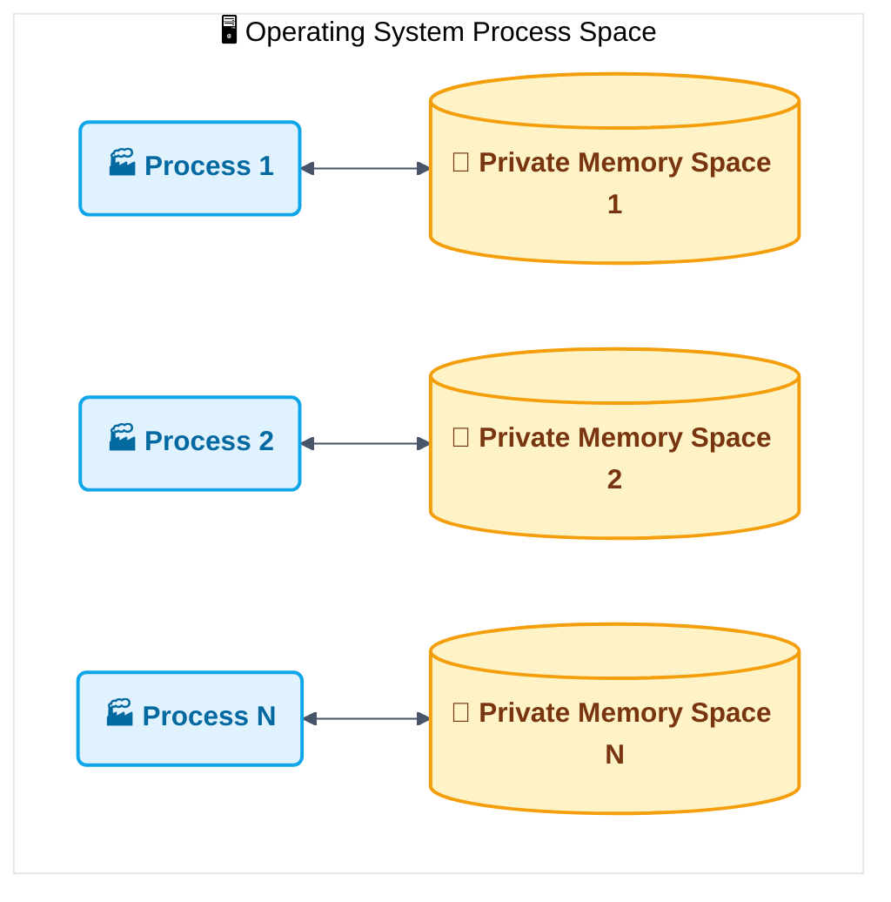
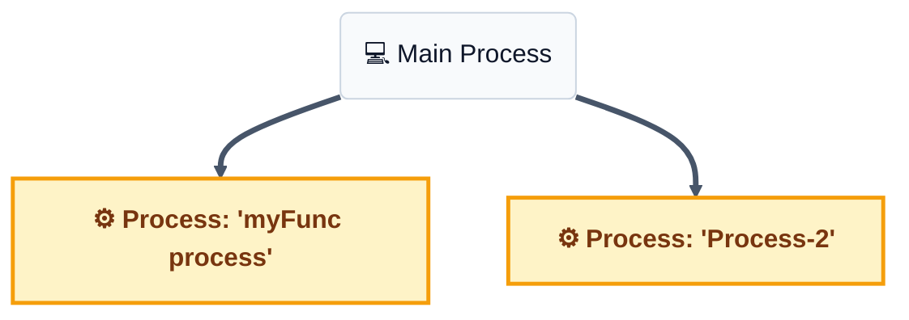
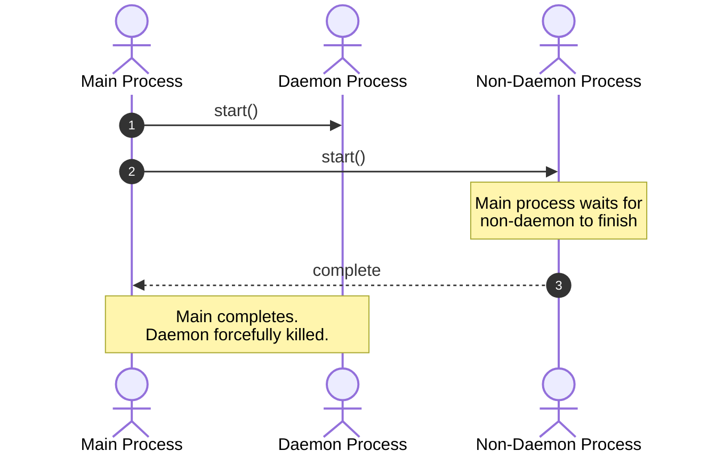
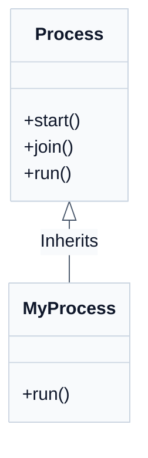
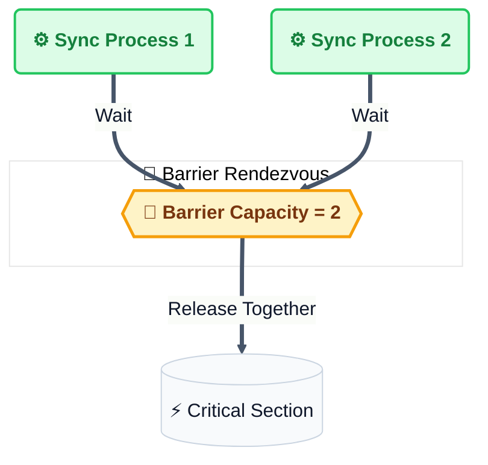
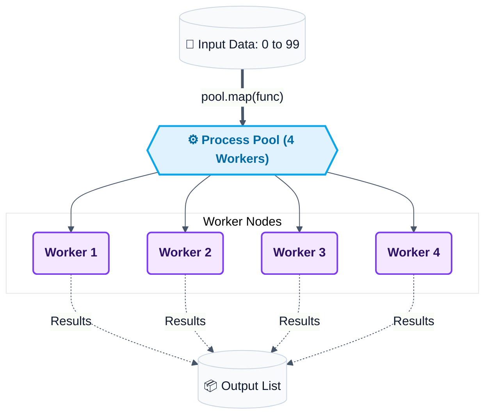

# Chapter 3: Process-Based Parallelism

> **Comprehensive Theory and Practical Implementation Guide**
> This chapter focuses on concurrency using multiple processes in Python, bypassing the Global Interpreter Lock (GIL) to achieve true parallelism for CPU-bound tasks.

---

## Table of Contents
1. [Understanding Python's multiprocessing module](#1-understanding-pythons-multiprocessing-module)
2. [Spawning a process](#2-spawning-a-process)
   - [2.1 Spawning Processes from a Separate Module](#21-spawning-processes-from-a-separate-module)
3. [Naming a process](#3-naming-a-process)
4. [Running processes in the background](#4-running-processes-in-the-background)
   - [4.1 Non-Daemon Background Processes](#41-non-daemon-background-processes)
5. [Killing a process](#5-killing-a-process)
6. [Defining processes in a subclass](#6-defining-processes-in-a-subclass)
7. [Using a queue to exchange data](#7-using-a-queue-to-exchange-data)
8. [Using pipes to exchange objects](#8-using-pipes-to-exchange-objects)
9. [Synchronizing processes](#9-synchronizing-processes)
10. [Using a process pool](#10-using-a-process-pool)

---

## 1. Understanding Python's multiprocessing module
The `multiprocessing` module allows the creation of isolated processes, each running its own Python interpreter. 
- **Bypassing the GIL:** Unlike the `threading` module, `multiprocessing` sidesteps the Global Interpreter Lock (GIL). This makes it perfectly suited for CPU-bound tasks.
- **Process Isolation:** Each process has its own memory space, which avoids data corruption by race conditions but requires specialized mechanisms like Pipes or Queues to communicate.

## 2. Spawning a process
A process is created by instantiating the `multiprocessing.Process` object and passing a target function.
- `start()` initiates the process.
- `join()` blocks the main process until the spawned process has completed.

**Example Implementation:** See [spawning_processes.py](Codes/spawning_processes.py)

### 2.1 Spawning Processes from a Separate Module
Instead of declaring the worker function in the same module, we can define the function in an external module and import it.

**Worker Module:** See [myFunc.py](Codes/myFunc.py)

**Spawning Script:** See [spawning_processes_namespace.py](Codes/spawning_processes_namespace.py)

## 3. Naming a process
Naming processes helps in debugging and identifying which process is executing. Use the `name` parameter in `multiprocessing.Process` or `multiprocessing.current_process().name` to differentiate them.

**Example Implementation:** See [naming_processes.py](Codes/naming_processes.py)

## 4. Running processes in the background
Processes can be set as `daemon=True` to run in the background. A background (daemon) process will be terminated abruptly when the main program exits, without completing its tasks or cleaning up resources.

**Example Implementation:** See [run_background_processes.py](Codes/run_background_processes.py)

### 4.1 Non-Daemon Background Processes
If a process is explicitly set to `daemon=False`, the main process will block and wait for it to exit, ensuring its tasks complete fully.

**Example Implementation:** See [run_background_processes_no_daemons.py](Codes/run_background_processes_no_daemons.py)

## 5. Killing a process
To explicitly terminate a process, call `process.terminate()`. This sends a SIGTERM signal (on Unix) or TerminateProcess (on Windows) to immediately stop it. The process `is_alive()` method helps check status.

**Example Implementation:** See [killing_processes.py](Codes/killing_processes.py)

## 6. Defining processes in a subclass
Like threads, you can inherit from `multiprocessing.Process` and override its `run()` method. This object-oriented approach is ideal when you need to maintain state inside the process.

**Example Implementation:** See [process_in_subclass.py](Codes/process_in_subclass.py)

## 7. Using a queue to exchange data
Because memory is isolated, sharing data requires inter-process communication (IPC) tools. `multiprocessing.Queue` operates identically to `queue.Queue` but is built for process-safe communication via locking mechanisms.

**Example Implementation:** See [communicating_with_queue.py](Codes/communicating_with_queue.py)

## 8. Using pipes to exchange objects
Pipes are preferred for high-speed, two-way communication between exactly two processes. `multiprocessing.Pipe()` returns a pair of connection objects representing the ends of a pipe.

**Example Implementation:** See [communicating_with_pipe.py](Codes/communicating_with_pipe.py)

## 9. Synchronizing processes
Like threads, processes can use synchronization primitives such as Lock, Event, Condition, and Barrier from the `multiprocessing` module to avoid resource contention.

**Example Implementation:** See [processes_barrier.py](Codes/processes_barrier.py)

## 10. Using a process pool
The `multiprocessing.Pool` class abstraction offers a convenient way to parallelize a function across multiple input values, distributing the input data across processes efficiently (data parallelism).
- `pool.map()` behaves like the built-in map, but chops tasks into chunks and farms them out to processes.

**Example Implementation:** See [process_pool.py](Codes/process_pool.py)

